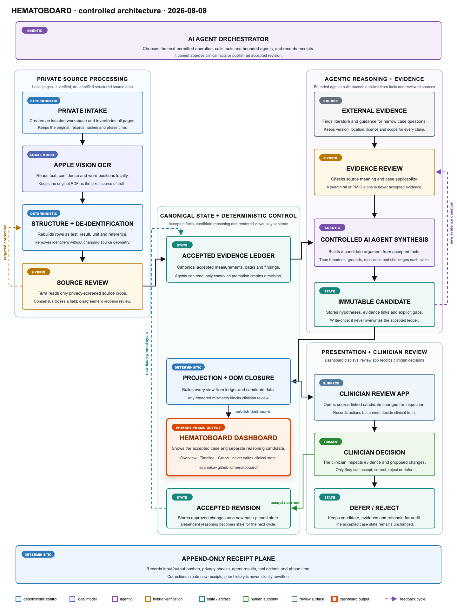
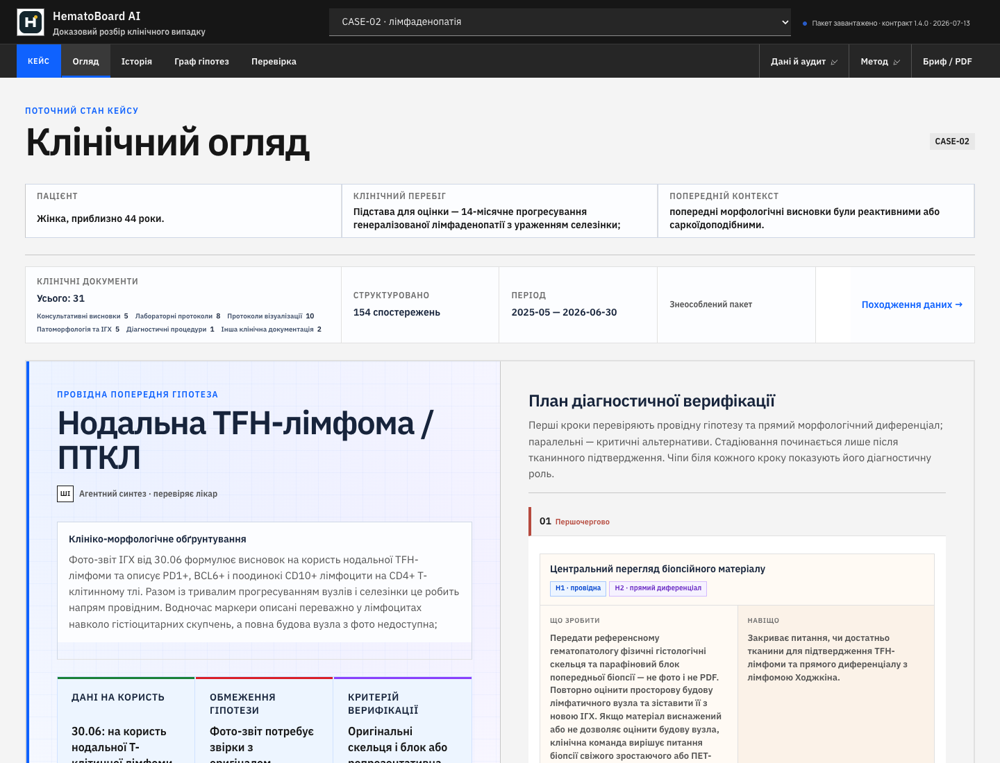
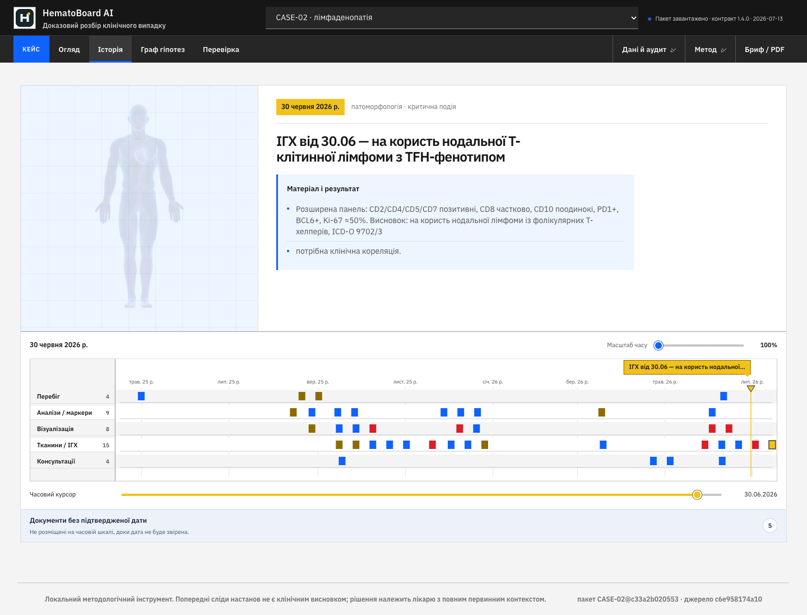
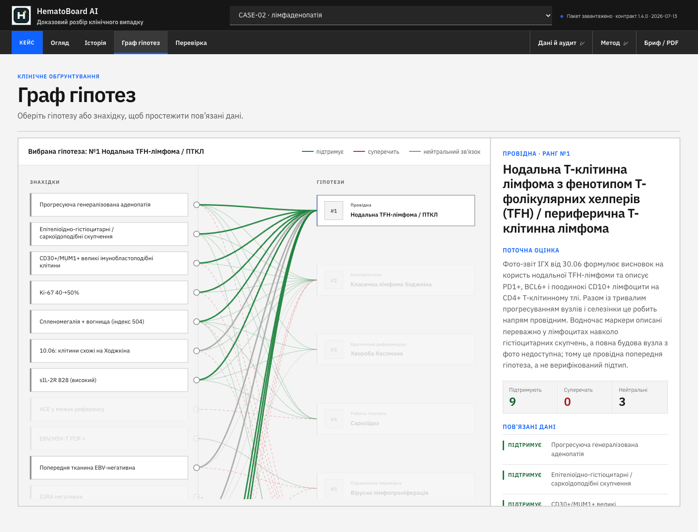

# HematoBoard

<!-- markdownlint-disable MD013 MD033 MD036 -->

## A clinician-controlled evidence and gap workbench for complex hematology cases

**Research preview · clinician-in-the-loop testing · code coming soon**

[Open the read-only demonstrator](https://esannikov.github.io/hematoboard/) ·
[Read the research article](https://esannikov.github.io/hematoboard/research.html) ·
[Inspect the architecture map](./diagrams/hematoboard-trace-system.svg) ·
[View the active public release receipt](./release.json)

HematoBoard is a provenance-first clinical reasoning environment for cases in
which the record is long, heterogeneous, and diagnostically unstable. It turns
scanned reports, laboratory tables, pathology, imaging, and clinical narrative
into a traceable case state; places candidate hypotheses beside the evidence
that supports or challenges them; and makes missing verification visible before
a clinician decides what to accept.

The system is not an autonomous diagnostician. Its central research question is
more practical: **can an AI-assisted workbench make every important statement
about a difficult case inspectable, source-bound, and reversible?**

The public demonstrator is a static, de-identified projection of prepared case
packages. Raw clinical documents, licensed guideline corpora, re-identification
keys, private audit logs, and the clinician acceptance service are not included.

---

## One controlled graph

The numbered sequence below describes trust dependencies, not one synchronous
job queue. Recognition can reopen a targeted source correction; a reasoning
candidate can generate a new evidence question; and an accepted revision starts
a new hash-pinned cycle. The graph therefore separates deterministic control,
local model inference, bounded agentic reasoning, immutable state, presentation
surfaces, and clinician authority.

1. A PDF or image enters a private, case-scoped quarantine.
2. Apple Vision performs local OCR and returns text with spatial coordinates.
3. A structured pipeline reconstructs measurements, units, reference ranges,
   dates, narrative findings, and table row relationships as JSON, with
   deterministic row/column invariants and hash-pinned review receipts.
4. Direct identifiers and unnecessary administrative fields are removed from
   the structured layer; the raw source remains private and unchanged.
5. Uncertain fields are reviewed against exact page crops. Corrections are
   append-only overlays rather than silent edits to OCR output.
6. Accepted observations become a versioned evidence ledger. External
   literature and guideline propositions are attached with source, version,
   location, verification, licence, and applicability receipts.
7. A context-shielded agent produces a separate, immutable reasoning candidate:
   hypotheses, typed relations, work-up questions, gaps, and limitations.
8. The browser projection is compared field by field with the ledger and the
   reasoning revision. A successful closure publishes the read-only
   **HematoBoard Dashboard** and separately opens the clinician review
   application. Only the latter can
   reach the clinician decision gate.

  
   
  <strong>Figure 1.</strong> HematoBoard controlled architecture. Each block states what it receives or performs, what it produces, and where its authority ends. Blue marks deterministic control; indigo marks local model inference; purple marks agentic reasoning; amber combines agent work with deterministic verification; teal marks immutable state; green marks clinician authority; muted blue marks the review surface; and coral identifies the primary public output—the read-only HematoBoard Dashboard. The accepted ledger and immutable candidate pass through deterministic projection closure before branching to the dashboard and the separate clinician review application. Feedback paths create new receipts or revisions; they never let an agent overwrite accepted state. Tap or click the image to inspect it at full size.

<a href="diagrams/hematoboard-trace-system.png">Open full-size PNG</a> · <a href="diagrams/hematoboard-trace-system.svg">Open scalable SVG</a>

---

## Three working surfaces

<table>
  <tr>
    <td width="33.33%" valign="top">
       
      <strong>Figure 2. Case overview.</strong> Accepted patient state, a clearly marked reasoning candidate, its unresolved limitation and named verification steps.
    </td>
    <td width="33.33%" valign="top">
       
      <strong>Figure 3. Clinical timeline.</strong> Canonical dates and source records; undated findings remain outside chronology rather than being placed on a guessed date.
    </td>
    <td width="33.33%" valign="top">
       
      <strong>Figure 4. Typed evidence graph.</strong> Supporting, challenging and contextual relations organise the argument; edge counts are not diagnostic probabilities.
    </td>
  </tr>
</table>

The screenshots come from the de-identified public CASE-02 demonstrator and show
the Ukrainian-language interface. They represent the public presentation layer,
not the private source-review workspace. CASE006 is not published here.

---

## Why the ledger matters

Clinical dashboards often become a second, weakly governed copy of the record.
HematoBoard treats the dashboard as a **read-only projection**. Canonical case
state lives in a versioned bundle; the interface is rebuilt from that bundle and
from one hash-pinned reasoning revision.

Every accepted observation has a stable identifier and, where available:

- document and page identity;
- source text and a page- or field-level crop receipt;
- normalized value, unit, comparator, and reference interval;
- effective date and date provenance;
- verification and privacy status;
- links to interpretations, hypotheses, and work-up questions.

The accepted bundle and agent reasoning are deliberately separate. A new model
run cannot overwrite the patient state. A revised bundle cannot silently retain
reasoning produced from older clinical input. A presentation change cannot
introduce clinical literals into HTML or JavaScript.

This design is related to the broader provenance logic formalised by W3C
PROV-O, but HematoBoard uses a smaller clinical contract centred on entities,
activities, responsible agents, immutable revisions, and exact source receipts.

---

## Reading difficult documents

Document interpretation is treated as measurement transfer, not as a single
OCR prompt.

**Local recognition.** Apple Vision runs on-device, returns recognized strings,
confidence, and bounding regions, and supports offline processing. HematoBoard
retains these coordinates so a field can be reopened at its exact location.

**Structure before de-identification.** Tables are reconstructed into strict
JSON while the original spatial relationships are still available. A laboratory
row, for example, binds a test name, result, unit, comparator, and reference
interval to one row identity. This prevents a flat text stream from shifting a
value into the neighbouring column.

**No silent correction.** OCR output is immutable. A human or multimodal agent
may propose that an ambiguous glyph means `ч`, not `4`, but the correction is a
separate receipt linked to the source crop, page hash, model or reviewer, and
timestamp.

**Selective agent adjudication.** Terra is the current orchestration name for a
bounded multimodal review role, not a source of clinical authority. For a
machine-resolved field, the current contract requires at least two independent
visual readings of the same de-identified crop, exact crop/manifest/word-ID
hashes, and deterministic consensus. Low confidence or disagreement leaves a
targeted review exception. Even unanimous machine readings are not equivalent
to clinical acceptance.

This is why the interface can offer one meaningful source-review gate rather
than exposing every internal OCR and transformation stage as a separate task for
the physician.

---

## Evidence and guideline method

HematoBoard does not treat search ranking as evidence. Retrieval and acceptance
are distinct operations.

For open literature, an agent formulates narrow clinical questions and searches
PubMed, DOI records, professional-society pages, and official classification or
regulatory sources. Each useful proposition is then checked against the source
for document identity, date, evidence type, context, and case applicability.

A **proposition-level receipt** is the structured evidence card for one clinical
statement—not merely a PMID or a document link. It records the exact proposition,
source identity and version, page or section, licence and model-use status, case
applicability, and the reviewer who verified it. Until that card is accepted,
the source may constrain a reasoning candidate but cannot establish guideline
concordance, diagnosis, stage, or treatment indication for the case.

When a licensed or locally supplied guideline corpus has been ingested, its PDFs
remain in the private workspace and deterministic ingest can produce page-level
text, manifests, and a case-local SQLite full-text index. FTS is an optional
locator for those prepared corpora; it is not the universal retrieval route and
cannot decide whether a recommendation applies to the patient. Applicability
remains a separate, source-cited assessment and can require clinician review.
Documents whose licences restrict model use are not sent to an external agent.

The practical sequence is therefore:

> agent-assisted discovery → deterministic source lookup → proposition-level
> verification → applicability check → ledger receipt

Guideline quality and reporting can be appraised with established instruments
such as AGREE II. Disease-specific classifications and practice guidelines are
versioned sources, not timeless background knowledge.

---

## Controlled agent synthesis

The reasoning agent receives a minimum-necessary clinical projection. Raw PDFs,
OCR traces, direct identifiers, UI state, previous ranking, and clinician
decisions are excluded from the initial breadth pass.

The current synthesis protocol has four controlled passes:

1. **Breadth** — generate plausible hypotheses and dangerous alternatives
   without inheriting the previous ranking.
2. **Grounding** — connect each claim to accepted observation identifiers and
   allowed external evidence.
3. **Reconciliation** — expose contradictions, missing tissue or staging data,
   and evidence that can change the ordering.
4. **Safety critic** — reject unsupported certainty, directive treatment
   language, stale inputs, broken provenance, and mixed accepted/candidate state.

The result is an immutable candidate revision with its own input snapshot,
method, comparison to the prior revision, gaps, limitations, and audit chain.
Research on human susceptibility to erroneous AI advice is one reason the
interface preserves uncertainty and clinician authority instead of presenting a
single model answer as settled truth.

---

## Formal invariants

These equations describe implemented verification logic. They are not decorative
clinical scores.

### 1. Field-level projection closure

Let $O$ be the accepted observation identifiers, $F$ the audited clinical
fields, $L(o,f)$ the ledger value, and $D(o,f)$ the value rendered in the
dashboard:

$$
C_{proj}=\frac{1}{|O||F|}\sum_{o\in O}\sum_{f\in F}
\mathbf{1}\!\left[D(o,f)=L(o,f)\right]
$$

Technical projection passes only when $C_{proj}=1$, the identifier sets are
identical, and static analysis finds no case-specific clinical values or bundle
identifiers embedded in page code. This is the ledger half of the gate. For
reasoning fields $Q$ — complete hypotheses, typed relations, work-up, gaps,
safety and method limitations, and revision comparison — HematoBoard also
requires:

$$
C_{reason}=\bigwedge_{q\in Q}
\mathbf{1}\!\left[D_{reason}(q)=R_{revision}(q)\right]=1
$$

A post-synthesis technical pass requires both closures.

### 2. Reasoning freshness

The clinical input is a canonical projection $\pi_{clin}(B)$ of accepted bundle
$B$, excluding prior hypotheses and presentation state:

$$
h_{in}=\operatorname{SHA256}\!\left(\pi_{clin}(B)\right)
$$

A candidate is fresh only if its recorded $h_{in}$ equals the hash of the
current clinical projection. Any clinically relevant bundle change makes the
older candidate stale and requires a new revision. This input hash covers the
clinical bundle, not a separately retrieved evidence corpus. External source
receipts and the complete candidate are bound by the immutable revision hash;
changing that corpus requires a new revision even when $h_{in}$ is unchanged.

### 3. Typed argument graph

$$
G=\left(V_F\cup V_H,\ E_{+}\cup E_{-}\cup E_{0}\right)
$$

$V_F$ are accepted findings, $V_H$ are candidate hypotheses, and the edge
sets represent supporting, challenging, and contextual/neutral relations. The
graph preserves the structure of an argument; it does not estimate
$P(\text{diagnosis}\mid\text{data})$.

### 4. Promotion boundary

$$
\operatorname{Eligible}=S\land P\land T\land H\land C
$$

where $S$ is source closure, $P$ privacy clearance, $T$ deterministic technical
verification, $H$ unchanged hash-pinned input, and $C$ an explicit
clinician decision. Eligibility is necessary but does not itself publish state:

$$
\operatorname{Promote}=\operatorname{Eligible}\land V_{tx}
$$

$V_{tx}$ is the successful promotion transaction: candidate-bundle
materialization, contract, graph and CaseScope validation, review-migration
dry-run, and atomic publication. If any term is false, the revision remains a
candidate.

---

## Privacy and safety with cloud agents

HematoBoard uses a local-first privacy boundary designed around data minimisation
and purpose limitation.

- Raw PDFs, page renders, direct identifiers, and the re-identification mapping
  remain in private case quarantine.
- Apple Vision OCR runs locally. De-identification is applied to the structured
  JSON layer after coordinates and table relationships have been preserved.
- A cloud agent receives only the approved, de-identified, minimum-necessary
  projection or a tightly scoped crop cleared for that operation.
- Browser or provider adapters fail closed until their isolation contract has
  passed conformance checks; configuration alone is not treated as proof of
  production isolation.
- Licensed guideline text is kept local when its terms do not permit external
  model processing.
- Agent outputs are candidates. They cannot alter the accepted ledger, publish a
  case, or record a clinician decision.
- Every material transformation is linked to version, hash, operation, and
  responsible human or agent identity.

De-identification reduces disclosure risk; it is not presented as proof of
irreversible anonymity. Deployment must still be governed by institutional,
legal, security, and ethics requirements. The research programme includes
planned tests of local multimodal and language models for crop adjudication,
evidence synthesis, and safety critique under the same receipt and projection
contracts. A local model will not receive broader authority merely because it is
local.

---

## Sources and methods

| Layer | Source families | What HematoBoard records |
| --- | --- | --- |
| Patient record | Laboratory, pathology, imaging, procedures, clinical narrative | Document, page/crop, field structure, date, verification and privacy status |
| Literature | PubMed, DOI records, peer-reviewed articles | Exact citation, evidence type, proposition, applicability and retrieval receipt |
| Guidelines | Official societies, classifications, institutional or licensed local PDFs | Edition, date, page/node, licence, model-use permission and review status |
| Provenance | Versioned JSON, SHA-256, immutable revisions, typed graph relations | Input/output identity, lineage, responsible agent and projection closure |
| Human authority | Source review and final clinician decision | Append-only acceptance, correction, rejection or deferral |

The system is informed by provenance standards, secure hashing, guideline
appraisal methods, human-factors research, and early-stage clinical AI reporting
guidance. Disease-specific sources are selected per case; they do not become
general recommendations merely by entering the evidence layer.

---

## Research status

HematoBoard is in **controlled clinician-in-the-loop testing** with prepared,
de-identified case packages. The current work evaluates source reconstruction,
measurement transfer, evidence traceability, reasoning freshness, projection
closure, and clinician-facing review ergonomics.

Formal external clinical validation, prospective effectiveness evaluation,
regulatory qualification, and deployment performance are not yet established.
The public demonstrator is a research interface and must not be used as a
diagnostic endpoint or a treatment recommendation system. Future evaluation is
intended to follow staged human-factors and early clinical AI reporting
principles, including DECIDE-AI where applicable.

Planned evaluation separates technical and clinical outcomes: exact field
transfer and projection closure, source-coverage and provenance failures,
appropriate agent abstention, correction recovery, clinician review time,
decision disagreement, and usability. No single aggregate score will be treated
as proof of clinical benefit.

## Code coming soon

The repository currently publishes the read-only research demonstrator,
de-identified example packages, diagrams, and release receipts. The private
clinical ingestion and acceptance runtime is intentionally excluded. Reusable
schemas, validators, and a sanitized reference pipeline are being prepared for a
later code release.

## Author and collaboration

**Eugene Sannikov** — system architecture, provenance method, agent workflow,
and interface research. Clinical development proceeds with specialist review;
collaborations in hematology, pathology, clinical informatics, privacy, and
prospective evaluation are welcome. [ORCID 0009-0008-9917-8461](https://orcid.org/0009-0008-9917-8461).

---

## References

Apple. (n.d.). *Recognizing text in images*. Apple Developer Documentation.
<https://developer.apple.com/documentation/vision/recognizing-text-in-images>

Brouwers, M. C., Kho, M. E., Browman, G. P., Burgers, J. S., Cluzeau, F.,
Feder, G., Fervers, B., Graham, I. D., Grimshaw, J., Hanna, S. E., Littlejohns,
P., Makarski, J., Zitzelsberger, L., & AGREE Next Steps Consortium. (2010).
AGREE II: Advancing guideline development, reporting and evaluation in health
care. *Journal of Clinical Epidemiology, 63*(12), 1308–1311.
<https://doi.org/10.1016/j.jclinepi.2010.07.001>

Campo, E., Jaffe, E. S., Cook, J. R., Quintanilla-Martinez, L., Swerdlow, S. H.,
Anderson, K. C., et al. (2022). The International Consensus Classification of
Mature Lymphoid Neoplasms: A report from the Clinical Advisory Committee.
*Blood, 140*(11), 1229–1253. <https://doi.org/10.1182/blood.2022015851>

d'Amore, F., Federico, M., de Leval, L., Ellin, F., Hermine, O., Kim, W. S.,
Lemonnier, F., Vermaat, J. S. P., Wulf, G., Buske, C., Dreyling, M., & Jerkeman,
M. (2025). Peripheral T- and natural killer-cell lymphomas: ESMO–EHA Clinical
Practice Guideline for diagnosis, treatment and follow-up. *Annals of Oncology,
36*(6), 626–644. <https://doi.org/10.1016/j.annonc.2025.01.023>

European Parliament & Council of the European Union. (2016). *Regulation (EU)
2016/679 (General Data Protection Regulation), Article 5*. Official Journal of
the European Union. <https://eur-lex.europa.eu/eli/reg/2016/679/oj>

Gaube, S., Suresh, H., Raue, M., Merritt, A., Berkowitz, S. J., Lermer, E.,
Coughlin, J. F., Guttag, J. V., Colak, E., & Ghassemi, M. (2021). Do as AI say:
Susceptibility in deployment of clinical decision-aids. *npj Digital Medicine,
4*, 31. <https://doi.org/10.1038/s41746-021-00385-9>

National Institute of Standards and Technology. (2015). *Secure Hash Standard
(SHS)* (FIPS PUB 180-4). <https://doi.org/10.6028/NIST.FIPS.180-4>

Vasey, B., Nagendran, M., Campbell, B., Clifton, D. A., Collins, G. S., Denaxas,
S., et al. (2022). Reporting guideline for the early-stage clinical evaluation
of decision support systems driven by artificial intelligence: DECIDE-AI.
*Nature Medicine, 28*, 924–933. <https://doi.org/10.1038/s41591-022-01772-9>

World Health Organization. (2021). *Ethics and governance of artificial
intelligence for health: WHO guidance*. World Health Organization.
<https://www.who.int/publications/i/item/9789240029200>

World Wide Web Consortium. (2013). *PROV-O: The PROV Ontology* (W3C
Recommendation). <https://www.w3.org/TR/prov-o/>

---

HematoBoard supports structured review and clinical discussion. Final clinical
responsibility remains with the treating team after review of the complete
primary record.
